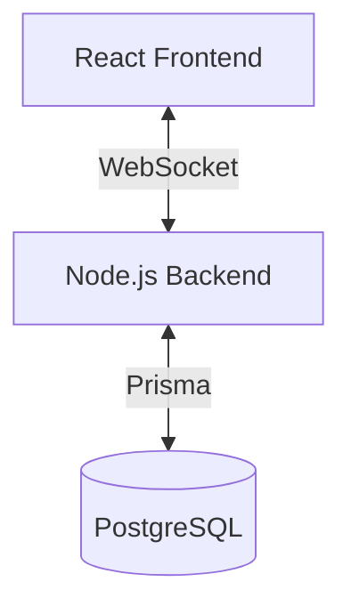

# FNLI Lotto Simulator - Architecture Overview

## System Architecture

The FNLI Lotto Simulator is built as a real-time application with a clear separation between frontend and backend services. The system uses WebSocket for real-time communication and PostgreSQL for data persistence.

## WebSocket over REST API

### Real-time Requirements

1. **Instant Updates**: Lottery draws need to be broadcast to the connected client immediately. WebSocket provides true real-time communication without polling or long-polling overhead.
2. **Bi-directional Communication**: WebSocket allows both server-to-client and client-to-server communication over a single connection, perfect for:
    - Broadcasting draw results to the client
    - Sending player selections to the server
    - Receiving immediate feedback on matches

### Performance Benefits

1. **Reduced Latency**: WebSocket maintains a persistent connection, eliminating the overhead of:
    - TCP connection establishment
    - HTTP headers
    - Request/response cycles
2. **Lower Server Load**: Instead of handling multiple HTTP requests per second, the server maintains a single connection per client
3. **Bandwidth Efficiency**: WebSocket frames are much lighter than HTTP requests, containing only the essential data

### Scalability

1. **Connection Management**: WebSocket connections are more efficient to maintain than multiple HTTP connections
2. **State Management**: The server can maintain session state more effectively
3. **Broadcast Capability**: Easy to implement features like:
    - Live draw results
    - Real-time statistics
    - Concurrent player updates

## Simple React Frontend over Next.js

### Simplicity and Performance

1. **Lightweight Architecture**: The application doesn't require:
    - Server-side rendering (SSR)
    - Static site generation (SSG)
    - Complex routing
    - API routes
2. **Faster Development**: Simpler setup and configuration with Vite
3. **Smaller Bundle Size**: No need to include Next.js runtime and features

### Real-time Focus

1. **Client-side State**: The application primarily manages real-time state, which is better suited for a client-side application
2. **WebSocket Integration**: Direct WebSocket connection without the complexity of Next.js API routes
3. **Immediate Updates**: No need for server-side rendering when content updates in real-time

### Cost and Resource Efficiency

1. **Simpler Deployment**: Can be deployed as static files on any CDN
2. **Lower Hosting Costs**: No need for Node.js server to serve the frontend
3. **Reduced Complexity**: Fewer moving parts means easier maintenance and debugging

## Database Design

The PostgreSQL database is used for:

1. **Persistence**: Storing winning tickets and draw history
2. **Data Integrity**: Ensuring transactional safety for draw operations
3. **Query Performance**: Efficient querying of historical data and statistics

## Future Scalability

The architecture allows for future enhancements:

1. **Horizontal Scaling**: WebSocket servers can be scaled horizontally
2. **Feature Additions**: Easy to add new real-time features
3. **Performance Optimization**: Room for implementing caching and optimization strategies

## Development Workflow

1. **Local Development**:

    - Frontend and backend run independently
    - Hot module replacement for fast development
    - TypeScript for type safety

2. **Testing Strategy**:

    - Unit tests for business logic
    - Integration tests for WebSocket communication
    - End-to-end tests for critical flows

3. **Deployment options**:
    - Frontend: Static file deployment
    - Backend: Containerized deployment
    - Database: Managed PostgreSQL service
